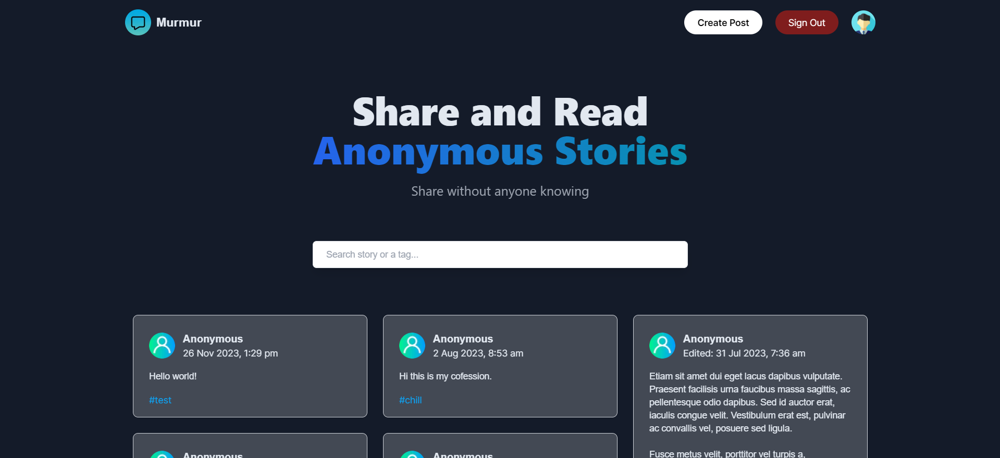

## About Murmur App

A web application about sharing and reading confessions anonymously without anyone knowing. A self-directed project with some references from online resources. View the application [here](https://murmur-n41mjebcg-adhamhshm.vercel.app/).



## Getting Started

First, run the development server:

```bash
npm run dev
# or
yarn dev
# or
pnpm dev
```

Open [http://localhost:3000](http://localhost:3000) with your browser to see the result.

